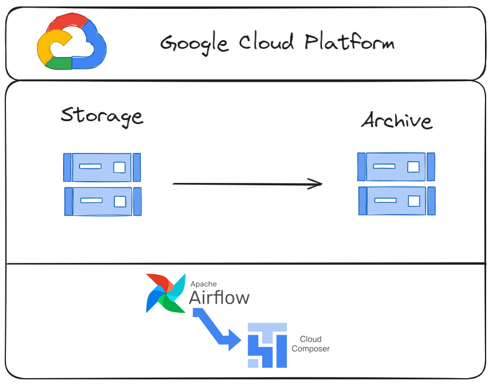

# Process Scheduling With Composer

## About
O projeto consiste em orquestrar uma movimentação de arquivos entre dois buckets no GCS, através do Composer (Airflow gerenciado pela Google Cloud Platform).

Video: https://www.youtube.com/watch?v=v9Kmz92yHok

## Developer
[Wallace Camargo](https://www.linkedin.com/in/wallace-camargo-35b615171/) 